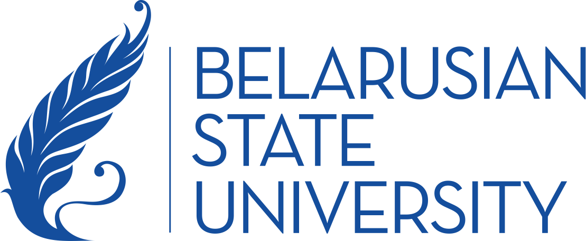

  
# 𝙃𝙚𝙡𝙡𝙤, 𝙄'𝙢 Artyom Golyak, also known as Tututka 😉

**17 y.o. | SENS Hardware Lead | C++, Python, Industrial Robotics | BSU FAMCS**

  
  &nbsp;&nbsp;&nbsp;
  

## 𝗖𝘂𝗿𝗿𝗲𝗻𝘁𝗹𝘆 𝘄𝗼𝗿𝗸𝗶𝗻𝗴 𝗼𝗻

  
### SENS Nexor · Hardware Project Lead

Я — **Hardware Project Lead** команды **SENS**, отвечаю за аппаратную часть **Nexor**. Проект помогает связывать события на производственной линии с телеметрией и логикой PLC, чтобы находить причины остановок и оценить влияние изменений в ПЛК. Nexor работает пассивно, поверх существующей инфраструктуры.
На данном моменте реализована ROS 2 симуляция на примере PLC Siemens S7.

**В фокусе проекта:** промышленная диагностика · PLC · STL / SCL · C++ · Python · ROS 2

  
### Space University BSU · участник программы

  

Участвую в **Space University BSU** — программе **StartUp Space BSU**, посвящённой предпринимательству и развитию стартапов.

## Technologies

---

